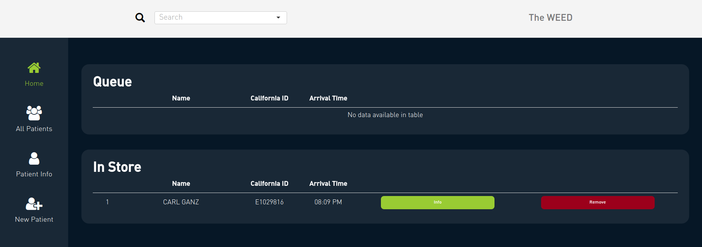
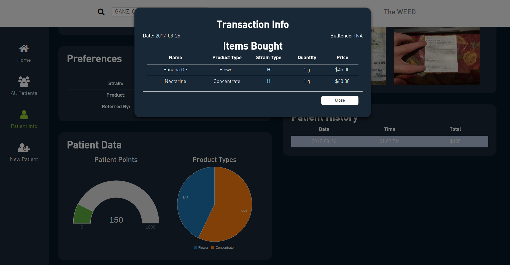
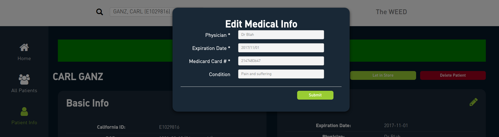
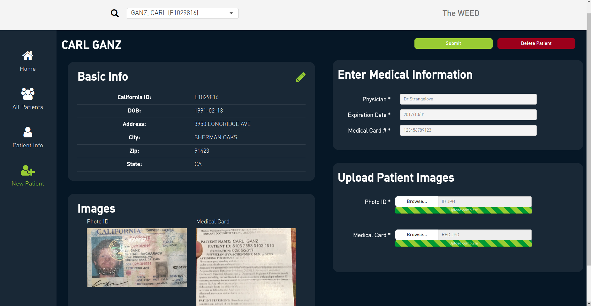

# Frontdesk

<link rel="icon" type="image/png" href="https://s3-us-west-2.amazonaws.com/cannadatacdn/CannaData_Logo.png">

The Frontdesk is where every dispensary first makes contact with their patrons. Dispensaries must keep track of all patrons, and verify that they are valid medical marijuana patients. This requires checking-in each patron when they enter the store. The CannnaData Frontdesk application provides facilities for:

* Checking-in patients

* Adding new patients

## Returning Patients

For returning patients, the front desk is responsible for:

* Validating the returning patient is who they say they are

* Making sure their medical card is still valid

* Controlling how many patients are allowed in the store at one time, and making sure that patients are processed in the correct order

All patient interactions begin by scanning the patient's state issued ID. For returning patients this will pull up the patient's profile where the budtender can quickly see the patient's current medical status, as well as other basic information about the patient. 

**(NOTE TO NAYELI: I don't know if the images are placed optimally in the patient info page. I tried this alternative set-up that may have potential but didn't really work out as I hoped. I'd appreciate your thoughts here.)**

This makes it easy to verify that the patient's medical card is still valid. You can also access a patient's info page by either searching for them in search box in the top, or by selecting them from the All Patients table. 

For valid patients, the budtender has buttons at the top that allow them to let the patient directly into the store, or if there is a line to get in to the store, they can add the patient to a queue. 

### Queue

The homepage of the Frontdesk app keeps track of who is currently in the store, and who is currently in line to get in the store (queue). These tables make it easy to see who is next in line, and how long people have been waiting. 

### Charts

The patient info page provides charts and tables that are useful to the budtender. This includes:

* The number of reward points the patient has accumulated (and how many more points they need to get a prize)

* Which types of products the patient has bought in the past

* Details of past transactions

### Updating Info

When a patient's medical card expires they have to get a new card, and bring that information to the dispensary. All information in the patient info page is editable including the medical card info, and patient images. 

## New Patients

For new patients, when their ID is scanned a message will appear indicating that the patient is new. The budtender has the option to add the new patient which initiates the patient sign-up process. 

When the patient's ID is first scanned, the information from their ID is automatically added. The budtender uploads the patient's documents, and enter a small amount of information from the patient's medical card, specifically the name of their doctor, the expiration date, and the medical card ID number. 

While the budtender enters this information, the patient is presented with an iPad (or other tablet or computer) where they enter their information into the Signup application discussed below.

### Signup

The Signup application works in conjunction with the Frontdesk app to let new patients quickly join a dispensary. When a new patient's ID is scanned they are added to the database, but their profile is incomplete. The budtender must input some information (discussed above), and the patient must complete the signup form (and sign the patient agreement), before they can enter the store. The first page of the signup form contains an input where the budtender can select the incomplete profile of the new patient. 

Once the incomplete profile is selected the budtender would hand the iPad over to the new patient who would fill out the rest of the form. The first page of the signup form is automatically filled in based on the information on the patient's driver's license. 

There are three additional pages where the patient fills in their contact info, and preferences. 

**(NOTE TO NAYELI: I think the patient preference input is an area where we can be creative. In liue of the plain old checkboxes we could use cool icons representing flower, concentrate, edibles, etc.)**

After the patient completes the form they are automatically sent to a page where they digitally sign the new patient agreement contract. This makes the signup process completely paperless. 

