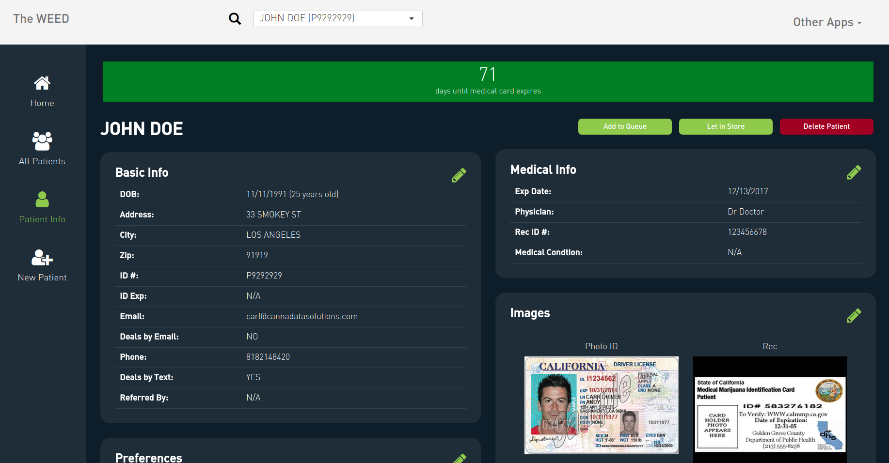
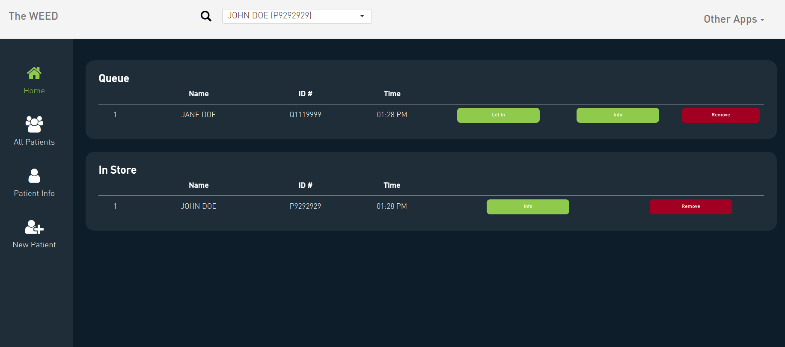
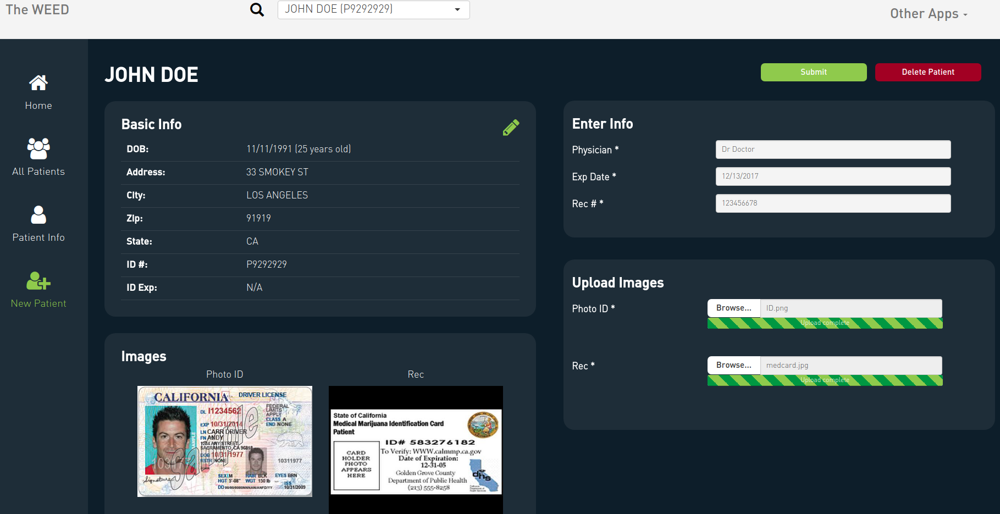
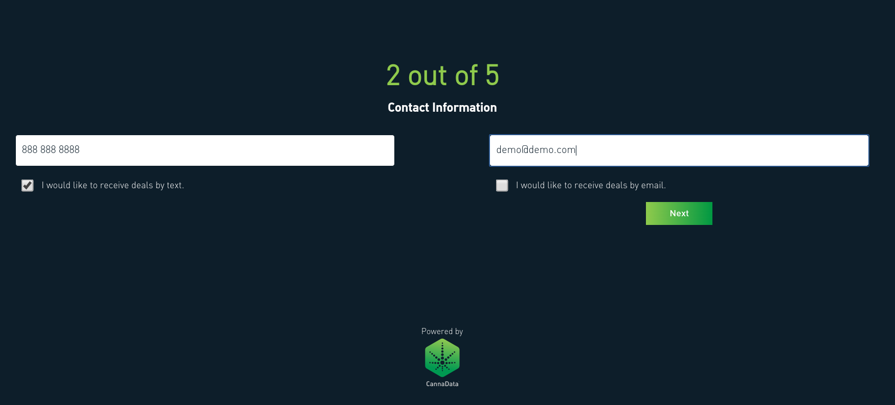
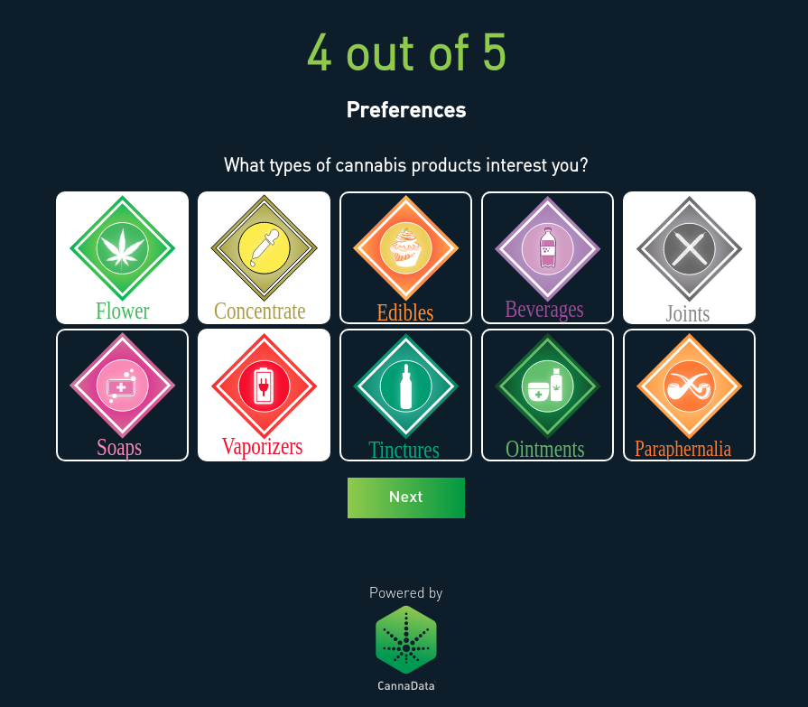
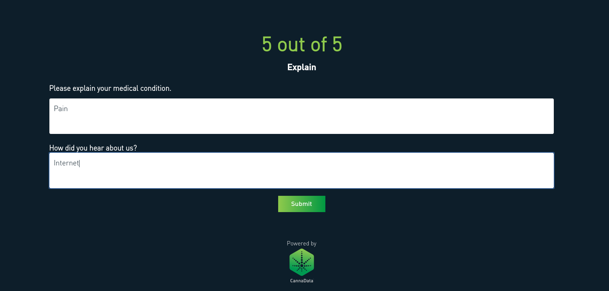

# Frontdesk

<link rel="icon" type="image/png" href="https://s3-us-west-2.amazonaws.com/cannadatacdn/CannaData_Logo.png">

The Frontdesk is where every dispensary first makes contact with their clients. Dispensaries must keep track of all customers, and verify that they are valid medical marijuana patients. The CannnaData Frontdesk application provides facilities for checking-in and accepting new customers. 

## Returning Patients

For returning clients, the front desk is responsible for:

* Validating a person is who they say they are

* Confirming they are a medical marijuana patient

* Controlling how many customers are allowed in the store at one time, and making sure that they are processed in the correct order

All patient interactions begin by scanning the client's state issued ID. For returning customers this will pull up the patient's profile where the budtender can quickly see the patient's current medical status, as well as other basic information about the patient. For valid patients, there are buttons for letting the patient directly into the store, or if there is a line to get in to the store, they can add the patient to the queue. 

The patient info page provides basic data about the patient, as well as their medical info. The box at the top displays the number of days left until the patient's medical card expires. When expired, the box is red. 

There are two graphs, one displaying the number of reward points the patient has accumulated, and a pie chart representing the product types from the patient's purchase history. 

You can view details of past transactions by selecting a row from the patient history table.

For patients with expired medical cards, the patient info page lets you edit, and update the patients medical info.

You can also access a patient's info page by either searching for them in search box at the top, or by selecting them from the All Patients tab. 

The All Patients tab also allows you to view, which patient profiles are incomplete, and which registered patients have expired medical cards.

### Queue

The homepage of the Frontdesk app keeps track of who is currently in the store, and who is currently in line to get in the store (queue). These tables make it easy to see who is next in line, and how long people have been waiting. 

## New Patients

For new patients, when their ID is scanned a message will appear indicating that the patient is new. The budtender has the option to add the new patient which initiates the patient sign-up process. 

When the patient's ID is first scanned, the information from their ID is automatically added. The budtender uploads the patient's documents, and enter a small amount of information from the patient's medical card, specifically the name of their doctor, the expiration date, and the medical card ID number. 

While the budtender enters this information, the patient is presented with an iPad (or other tablet or computer) where they enter their information into the Signup application discussed below.

### Signup

The Signup application works in conjunction with the Frontdesk app to let new patients quickly join a dispensary. When a new patient's ID is scanned they are added to the database, but their profile is incomplete. The budtender must input the patient's medical information (discussed above), and the patient must complete the signup form (and sign the patient agreement), before they can enter the store. The first page of the signup form contains an input where the budtender can select the incomplete profile of the new patient. If only one patient is signing up they will automatically be selected. 

Once the incomplete profile is selected the budtender would hand the iPad over to the new patient who would fill out the rest of the form. The first page of the signup form is automatically filled in based on the information on the patient's driver's license. 

There are four additional pages where the patient fills in their contact info, and preferences. 

After the patient completes the form they are automatically sent to DocuSign where they digitally sign the new patient agreement contract. This makes the signup process completely paperless. 

