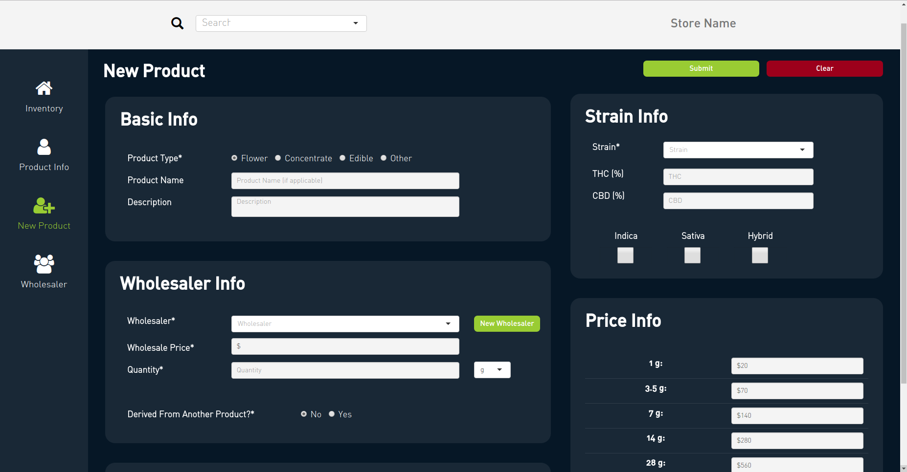
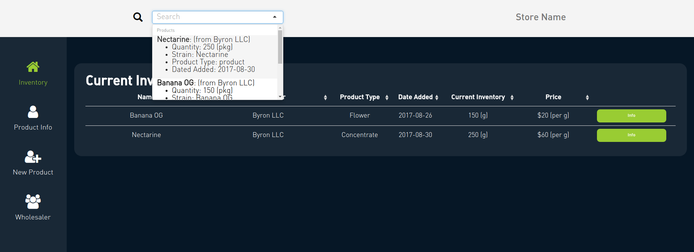
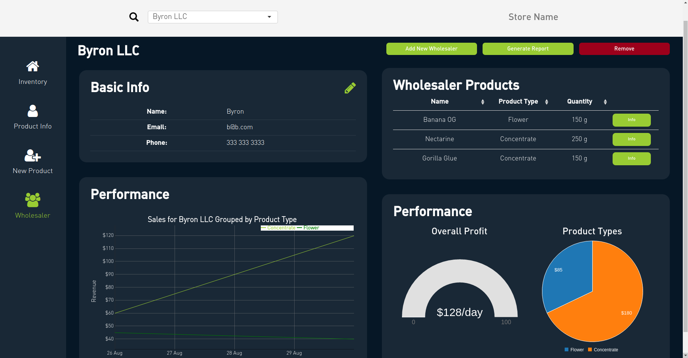

# Inventory

<link rel="icon" type="image/png" href="https://s3-us-west-2.amazonaws.com/cannadatacdn/CannaData_Logo.png">

The Inventory Management application provides facilities for:

* Adding new inventory and new wholesalers

* Viewing the performance of past products and wholesalers

* Checking quantities of current stock

* Updating/editing information about existing products

* Print labels/barcodes for inventory

## New Inventory

The new inventory page allows you to enter new shipments of inventory into your database. Digitally managing inventory doesn't just make it easier to keep track of products, but it also simplifies the record keeping process required for taxes, and other regulations.

There are several required fields in the new inventory form:

* Product Type (i.e. flower vs concentrate vs edible etc.)

* Strain (No strain is an option, but must be explicitely selected)

* Wholesaler

* Wholesale price

* Quantity

* Price

There are also several optional inputs, and inputs that are only required sometimes:

* Product Name (required if no strain selected)

* Description

* THC & CBD levels

* Whether product is Indica/Sativa/Hybrid

* Image

* Source product and quantity (i.e. if you take 50 grams of Banana OG and make 75 joints, when you enter the 75 joints you would also want to remove the 50 grams of Banana OG that the joints are derived from)

### Pricing

The price input contains default values based on the product type. Whenever a value in the price input is updated, the rows below the changed value, representing the price for larger quantities, are updated to be consistent with the new value. For example, the default price for concentrates is \$30 per half gram. This rate is used for higher quantities so 1 gram is \$30\*2=\$60, two grams is \$30\*4=\$120, etc. We can update the price for two grams to \$100, which translates to \$50 per gram. Now all quantities above two grams are priced at the \$50 per gram rate, while all quantities below two grams retain the \$30 per half gram (\$60 per gram) rate. 

## Past Products

Details about existing and past products are easily accessible. You can search for any past inventory and all wholesalers in the search box at the top. You can also view current inventory in the current inventory table.

When you select an item you are taken to the product information page. This includes a variety of tables regarding the specific product with the option to edit. Buttons at the top allow to quickly add more inventory and print barcodes for the product.

Basic analytics are provided so you can quickly see how the product is performing. Daily sales are charted, and average daily profit is rated against other similar products.

## Wholesaler

You can also view information about specific wholesalers. When you select an item the item's wholesaler is available in the wholesaler page. You can also select a wholesaler in the search box at the top.

Analytics about the wholesaler including daily sales, average daily profit, and product type. 
