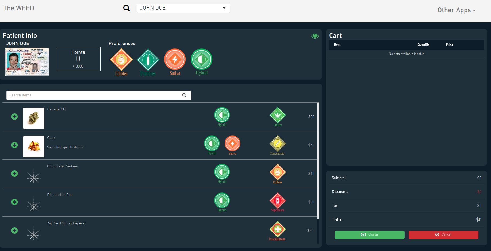
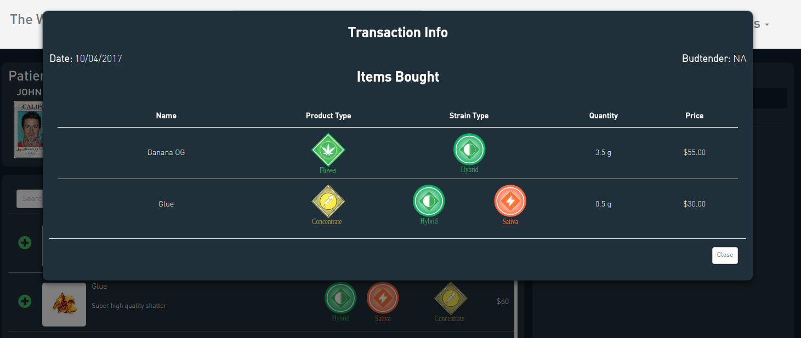
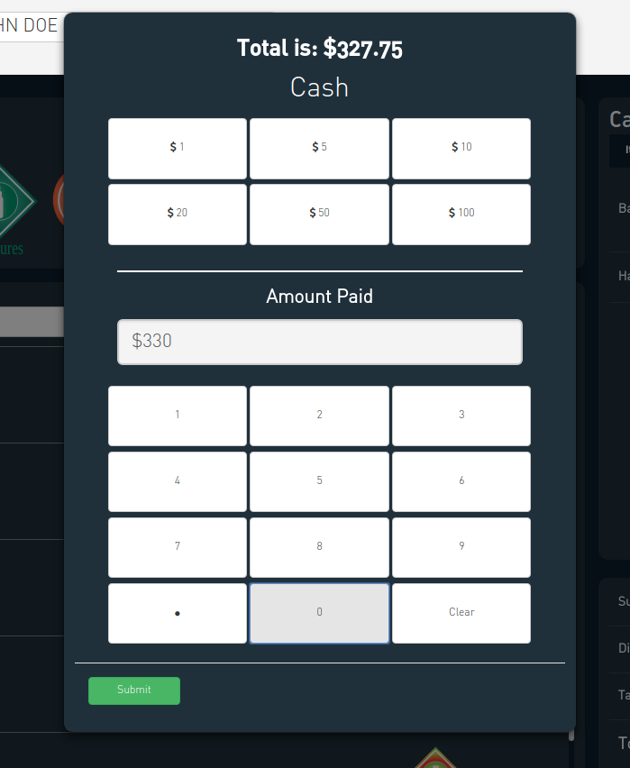

# Point of Sales

The point-of-sales application provides facilities for:

* Viewing patient info

* Viewing current inventory

* Processing transactions

## Patient Selection

To begin, you must select the current patient. The list of checked-in patients is available in the navbar. 

## Patient Info

Once a patient is selected, their information appears at the top. 

A more information about the patient is available by pressing the eyeball to the top right of the patient information.

This provides details about the patient's purchase history, as well as the specifics of the patient's previous transactions.

## Sales

There are two ways to add an item to the cart: by scanning a barcode, or by selecting an item from the inventory table. When scanned, or selected, the budtender is prompted to enter the exact information about the sale: the quantity sold, and the price. The budtender also has the option of applying a discount. (The discount info is automatically populated if you register the coupon in the connect app i.e. if you create Wax Wednesday the discount will automaticaly populate for concentrates on Wednesdays)

You can enter arbitrary quantities, and it will determine the price. Discounts can be added as either flat rates (i.e. $10) or percentages.

When added, the item appears in the cart. This information is not session specific so you can leave the app, or process another patient's transaction, and when you return the item will remain in the patient's cart.

Item's in the cart can be edited by pressing the green pencil.

## Searching

When not using a barcode, it is often useful to search for the item you are entering by name. You can also search for items by various attributes like product type, strain name, strain type, and description.

## Completing Transaction

To complete the transaction press the green "charge" button on the bottom right. This will prompt the budtender to enter the amount of cash tendered. The budtender can enter the amount by either entering the bills (i.e. if budtender is handed two twenties and a ten they press $20, $20, $10) or by simply entering the amount (i.e. press 5 then 0).

Once the amount paid is submitted, the amount of change is returned, and the transaction is complete.

