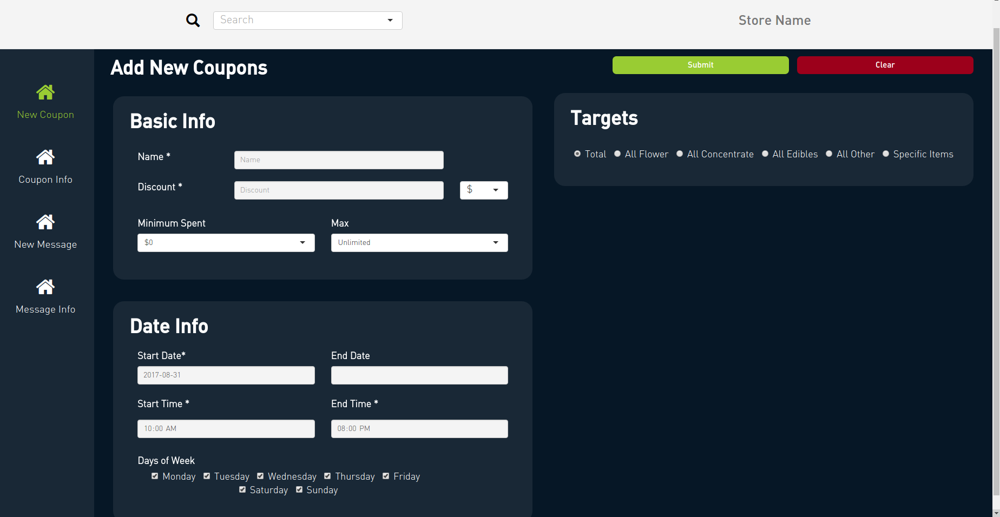
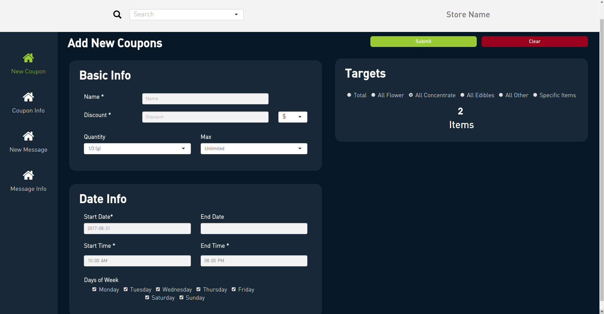
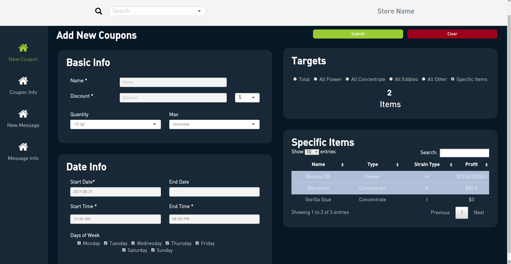
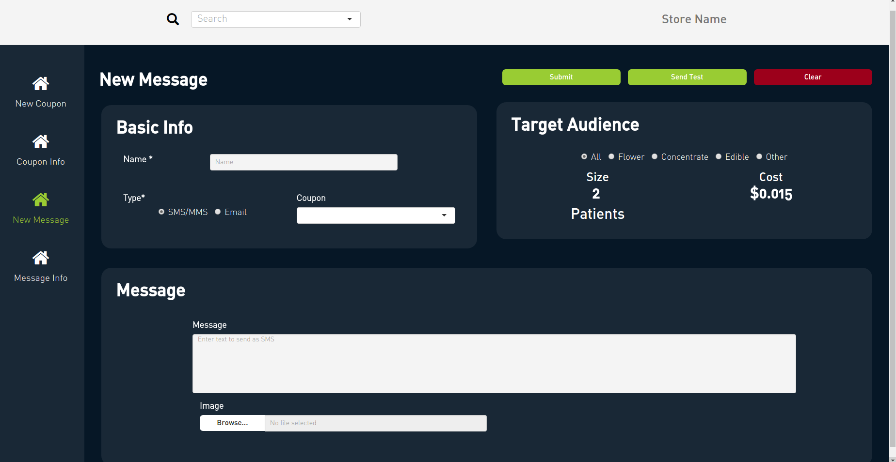
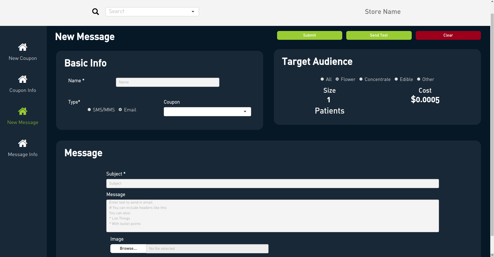

# Connect

<link rel="icon" type="image/png" href="https://s3-us-west-2.amazonaws.com/cannadatacdn/CannaData_Logo.png">

Many dispensaries try to encourage patients to come to their store with coupons, and targeted messages. The Connect Application provides facilities for:

* Creating coupons/deals

* Reaching out to patients via text, or email

## Coupons

### New Coupons

The required information for a new coupon is:

* A name

* A discount (either a flat amount i.e. $10, or a percentage i.e. 10%)

* A minimum (either a minimum total amount spent i.e. $60, or a quantity i.e. 3.5 grams)

* Which products the discount applies to. Options include:

1. Total (i.e. take 10% off total bill)
2. All products of a certain type (i.e. on Wax Wednesdays you discount **all** concentrates)
3. Specific products

* Lastly you have to choose when the coupon is active

**(NOTE TO NAYELI: For specific items there is a problem in that you are forced to select a single discount, and quantity for all the specific items. It would be better if they could select different discounts and quantities for the individual items. When you send me code for menu I may use a version of that to recreate the specific item part. I'd appreciate your thoughts here.)**

### Coupon Info

You can view information about existing coupons by selecting them in the search box in the top. The coupon info page provides basic information that can be edited as well as a list of current inventory that is discounted when the coupon is active. There is a graph of daily sales for the discounted products, which enables you to see if the coupon created a positive bump.

## Messages

### New Messages

To send a new message out to patients you are required to enter:

* A name 

* Message type (text or email)

* Audience (based on patient preferences)

* The message

* If you send an email a subject is required

### Message Info

You can review the info about past messages by selected the message in the search box at the top. This will give you basic info about the message like when it was sent, to whom, and its content. There is also a graph of daily sales of the patients who were messaged, which makes it easy to check whether the message let to a noticable increase in sales.

